# DATABASE.md — ERD & Dokumentasi Schema

Dokumentasi Entity Relationship Diagram (ERD) dan kamus data untuk
**Dashboard Monitoring Programmatic Ads & Website Performance**.

- **DBMS:** PostgreSQL
- **Sumber eksekusi schema:** Laravel migrations di `backend/database/migrations/`
- **DDL referensi:** [`Database.sql`](Database.sql) (representasi PostgreSQL dari migration)
- **Konvensi:** entity utama memakai **UUID**, di-generate di aplikasi (Eloquent `HasUuids`); seluruh tabel domain memiliki `created_at` / `updated_at` (`timestamps()`).

> Jika ada perubahan schema, **selalu** lakukan lewat migration Laravel, lalu sinkronkan
> `Database.sql` dan dokumen ini (CLAUDE.md › Do Not Do #9).

---

## 1. Ringkasan Grup Tabel

| Grup | Tabel | Peran |
|---|---|---|
| **Auth & Identity** | `users`, `password_reset_tokens` | Pengguna dashboard + RBAC, reset password |
| **Dimensi / Referensi** | `domains`, `pages`, `ad_slots`, `bidders` | Master data yang dirujuk metrik |
| **Metrik Agregat Harian** | `slot_performance_daily`, `bidder_performance_daily`, `web_vitals_daily` | Pra-agregasi per hari; dibaca dashboard |
| **Event / Time-series** | `prebid_auctions`, `gam_requests`, `network_ad_requests`, `server_checks` | Event granular berbasis waktu |
| **Alerts & Insights** | `alerts`, `insights` | Hasil evaluasi threshold & rekomendasi |
| **Modul Operasional** | `security_scans`, `page_previews` | Security Inspector & Ad-Layout Preview |
| **Sistem Laravel** | `cache`, `cache_locks`, `jobs`, `job_batches`, `failed_jobs` | Infrastruktur (cache/queue), bukan domain bisnis |

**Prinsip kunci (CLAUDE.md › Database Guidelines):** dashboard membaca dari tabel
agregat (`*_daily`), **bukan** langsung dari raw event. Event granular (`prebid_auctions`,
`gam_requests`, `network_ad_requests`, `server_checks`) bersifat append-heavy dan
kandidat partisi / retensi bila volume bertumbuh.

---

## 2. ERD — Diagram Relasi

```mermaid
erDiagram
    users ||--o{ alerts          : "acknowledges"
    users ||--o{ security_scans  : "requests"
    users ||--o{ page_previews   : "requests"

    domains ||--o{ pages                    : has
    domains ||--o{ ad_slots                 : has
    domains ||--o{ slot_performance_daily   : aggregates
    domains ||--o{ bidder_performance_daily : aggregates
    domains ||--o{ web_vitals_daily         : aggregates
    domains ||--o{ prebid_auctions          : logs
    domains ||--o{ gam_requests             : logs
    domains ||--o{ network_ad_requests      : logs
    domains ||--o{ server_checks            : monitors
    domains ||--o{ security_scans           : scans
    domains ||--o{ page_previews            : previews
    domains ||--o{ alerts                   : "scoped to"
    domains ||--o{ insights                 : "scoped to"

    pages ||--o{ prebid_auctions      : "on"
    pages ||--o{ gam_requests         : "on"
    pages ||--o{ network_ad_requests  : "on"
    pages ||--o{ web_vitals_daily     : "on"
    pages ||--o{ page_previews        : "on"

    ad_slots ||--o{ slot_performance_daily   : aggregates
    bidders  ||--o{ bidder_performance_daily : aggregates

    users {
        uuid id PK
        string name
        string email UK
        timestamp email_verified_at
        string password
        string role "enum Role"
        string remember_token
    }

    domains {
        uuid id PK
        string name
        string url
        boolean is_active
    }

    pages {
        uuid id PK
        uuid domain_id FK
        string path
        string title
    }

    ad_slots {
        uuid id PK
        uuid domain_id FK
        string name
        string ad_unit_path
        json sizes
        string device "enum Device"
        boolean is_active
    }

    bidders {
        uuid id PK
        string name
        string code UK
        boolean is_active
    }

    slot_performance_daily {
        uuid id PK
        date date
        uuid domain_id FK
        uuid slot_id FK
        string device
        bigint ad_requests
        bigint impressions
        decimal revenue
        decimal ecpm
        decimal fill_rate
        decimal viewability
    }

    bidder_performance_daily {
        uuid id PK
        date date
        uuid domain_id FK
        uuid bidder_id FK
        bigint bid_requests
        bigint bid_responses
        bigint bids_won
        bigint timeouts
        bigint errors
        decimal avg_latency_ms
        decimal revenue
        decimal avg_cpm
    }

    prebid_auctions {
        uuid id PK
        string auction_id
        uuid domain_id FK
        uuid page_id FK
        string device
        timestamp started_at
        int duration_ms
        int bidder_count
        int bids_received
        int timeouts
        int errors
        string won_bidder
        decimal cpm
        string status
    }

    gam_requests {
        uuid id PK
        uuid domain_id FK
        uuid page_id FK
        string device
        timestamp requested_at
        string ad_unit
        string status
        int latency_ms
        int http_status
        string line_item_id
        string creative_id
    }

    network_ad_requests {
        uuid id PK
        uuid domain_id FK
        uuid page_id FK
        string device
        timestamp observed_at
        text resource_url
        string vendor
        string type
        bigint size_bytes
        int duration_ms
        boolean is_third_party
        boolean is_blocking
        int status_code
    }

    web_vitals_daily {
        uuid id PK
        date date
        uuid domain_id FK
        uuid page_id FK
        string device
        decimal lcp
        decimal inp
        decimal cls
        decimal fcp
        decimal ttfb
        decimal tbt
        bigint samples
    }

    alerts {
        uuid id PK
        string severity "enum Severity"
        string category "enum AlertCategory"
        string metric
        decimal current_value
        decimal threshold_value
        string entity_type "polymorphic"
        uuid entity_id "polymorphic"
        string entity_label
        uuid domain_id FK
        text message
        text suggested_action
        string status "enum AlertStatus"
        uuid acknowledged_by FK
        timestamp acknowledged_at
        timestamp triggered_at
    }

    insights {
        uuid id PK
        string title
        text description
        string type
        string impact
        string related_metric
        uuid domain_id FK
        timestamp generated_at
    }

    server_checks {
        uuid id PK
        uuid domain_id FK
        timestamp checked_at
        string status
        int response_time_ms
        int http_status
        string region
        string error_message
    }

    security_scans {
        uuid id PK
        uuid domain_id FK
        string target_url
        string target_host
        string status
        string grade
        smallint score
        json results
        text error
        uuid requested_by FK
        timestamp started_at
        timestamp finished_at
    }

    page_previews {
        uuid id PK
        uuid domain_id FK
        uuid page_id FK
        string device
        string url
        string status
        string image_path
        int page_width
        int page_height
        int viewport_css_width
        smallint slot_count
        json slots
        json header
        text error
        uuid requested_by FK
        timestamp captured_at
    }
```



> Diagram di atas memakai sintaks **Mermaid** dan ter-render otomatis di GitHub,
> GitLab, VS Code (ekstensi Mermaid), dan Obsidian.

---

## 3. Matriks Relasi (Foreign Key)

| Child table | Kolom FK | → Parent | On Delete | Catatan |
|---|---|---|---|---|
| `pages` | `domain_id` | `domains.id` | CASCADE | Hapus domain → hapus halaman |
| `ad_slots` | `domain_id` | `domains.id` | CASCADE | |
| `slot_performance_daily` | `domain_id` | `domains.id` | CASCADE | |
| `slot_performance_daily` | `slot_id` | `ad_slots.id` | CASCADE | |
| `bidder_performance_daily` | `domain_id` | `domains.id` | CASCADE | |
| `bidder_performance_daily` | `bidder_id` | `bidders.id` | CASCADE | |
| `prebid_auctions` | `domain_id` | `domains.id` | CASCADE | |
| `prebid_auctions` | `page_id` | `pages.id` | SET NULL | Nullable |
| `gam_requests` | `domain_id` | `domains.id` | CASCADE | |
| `gam_requests` | `page_id` | `pages.id` | SET NULL | Nullable |
| `network_ad_requests` | `domain_id` | `domains.id` | CASCADE | |
| `network_ad_requests` | `page_id` | `pages.id` | SET NULL | Nullable |
| `web_vitals_daily` | `domain_id` | `domains.id` | CASCADE | |
| `web_vitals_daily` | `page_id` | `pages.id` | SET NULL | Nullable |
| `server_checks` | `domain_id` | `domains.id` | CASCADE | |
| `security_scans` | `domain_id` | `domains.id` | CASCADE | |
| `security_scans` | `requested_by` | `users.id` | SET NULL | Nullable |
| `page_previews` | `domain_id` | `domains.id` | CASCADE | |
| `page_previews` | `page_id` | `pages.id` | SET NULL | Nullable |
| `page_previews` | `requested_by` | `users.id` | SET NULL | Nullable |
| `alerts` | `domain_id` | `domains.id` | SET NULL | Nullable |
| `alerts` | `acknowledged_by` | `users.id` | SET NULL | Nullable |
| `insights` | `domain_id` | `domains.id` | SET NULL | Nullable |

> **`alerts.entity_type` + `entity_id` bersifat polymorphic** (menunjuk `domain`/`slot`/`bidder`/`page`) dan **sengaja tidak diberi FK** agar fleksibel lintas entitas.

---

## 4. Enum

Enum didefinisikan sebagai PHP backed-enum (`app/Enums/`) dan disimpan sebagai `varchar` di DB (bukan tipe `ENUM` PostgreSQL).

| Enum | Kolom pemakai | Nilai |
|---|---|---|
| `Role` | `users.role` | `admin`, `programmatic_revenue`, `adops`, `tech`, `viewer` |
| `Device` | `*.device` | `desktop`, `mobile`, `tablet` |
| `Severity` | `alerts.severity` | `low`, `medium`, `high`, `critical` |
| `AlertCategory` | `alerts.category` | `bidding`, `prebid`, `gam`, `web_vitals`, `revenue`, `network`, `slot`, `server` |
| `AlertStatus` | `alerts.status` | `open`, `acknowledged`, `resolved` |

Status berbasis string lain (belum berupa enum class):

| Kolom | Nilai valid |
|---|---|
| `prebid_auctions.status` | `completed` (default), dll. |
| `gam_requests.status` | `success`, `empty`, `failed` |
| `network_ad_requests.type` | `script`, `xhr`, `img`, `css`, `font` |
| `server_checks.status` | `up`, `down` |
| `security_scans.status` | `completed`, `failed` |
| `security_scans.grade` | `A`..`F` |
| `page_previews.status` | `completed`, `failed` |
| `insights.type` | `optimization`, `anomaly`, `trend` |
| `insights.impact` | `low`, `medium`, `high` |

---

## 5. Kamus Data

Notasi tipe mengikuti PostgreSQL. `string` = `varchar(255)`. Kolom `created_at`/`updated_at` (nullable timestamp) ada di semua tabel domain dan diringkas sebagai *timestamps* di akhir tiap tabel.

### 5.1 `users`
Pengguna dashboard + RBAC.

| Kolom | Tipe | Null | Default | Keterangan |
|---|---|:--:|---|---|
| `id` | uuid | ✗ | — | PK |
| `name` | string | ✗ | — | |
| `email` | string | ✗ | — | **UNIQUE** |
| `email_verified_at` | timestamp | ✓ | — | |
| `password` | string | ✗ | — | hash bcrypt/argon |
| `role` | string | ✗ | `viewer` | enum `Role`; **indexed** |
| `remember_token` | varchar(100) | ✓ | — | |
| *timestamps* | | | | |

### 5.2 `password_reset_tokens`
| Kolom | Tipe | Null | Keterangan |
|---|---|:--:|---|
| `email` | string | ✗ | **PK** |
| `token` | string | ✗ | |
| `created_at` | timestamp | ✓ | |

### 5.3 `domains`
Properti web yang dimonitor — akar hampir seluruh relasi.

| Kolom | Tipe | Null | Default | Keterangan |
|---|---|:--:|---|---|
| `id` | uuid | ✗ | — | PK |
| `name` | string | ✗ | — | |
| `url` | string | ✗ | — | |
| `is_active` | boolean | ✗ | `true` | |
| *timestamps* | | | | |

### 5.4 `pages`
| Kolom | Tipe | Null | Default | Keterangan |
|---|---|:--:|---|---|
| `id` | uuid | ✗ | — | PK |
| `domain_id` | uuid | ✗ | — | FK → `domains` (CASCADE) |
| `path` | string | ✗ | — | |
| `title` | string | ✓ | — | |
| *timestamps* | | | | |

Index: `(domain_id, path)`.

### 5.5 `ad_slots`
| Kolom | Tipe | Null | Default | Keterangan |
|---|---|:--:|---|---|
| `id` | uuid | ✗ | — | PK |
| `domain_id` | uuid | ✗ | — | FK → `domains` (CASCADE) |
| `name` | string | ✗ | — | |
| `ad_unit_path` | string | ✗ | — | GAM ad unit path |
| `sizes` | json | ✓ | — | array ukuran kreatif |
| `device` | string | ✗ | `desktop` | enum `Device`; **indexed** |
| `is_active` | boolean | ✗ | `true` | |
| *timestamps* | | | | |

Index: `device`, `domain_id`.

### 5.6 `bidders`
| Kolom | Tipe | Null | Default | Keterangan |
|---|---|:--:|---|---|
| `id` | uuid | ✗ | — | PK |
| `name` | string | ✗ | — | |
| `code` | string | ✗ | — | **UNIQUE**; Prebid bidder code |
| `is_active` | boolean | ✗ | `true` | |
| *timestamps* | | | | |

### 5.7 `slot_performance_daily`
Agregat performa slot per hari/device.

| Kolom | Tipe | Null | Default | Keterangan |
|---|---|:--:|---|---|
| `id` | uuid | ✗ | — | PK |
| `date` | date | ✗ | — | **indexed** |
| `domain_id` | uuid | ✗ | — | FK → `domains` (CASCADE) |
| `slot_id` | uuid | ✗ | — | FK → `ad_slots` (CASCADE) |
| `device` | string | ✗ | — | enum `Device`; **indexed** |
| `ad_requests` | bigint | ✗ | `0` | unsigned (app) |
| `impressions` | bigint | ✗ | `0` | unsigned (app) |
| `revenue` | numeric(14,4) | ✗ | `0` | |
| `ecpm` | numeric(10,4) | ✗ | `0` | |
| `fill_rate` | numeric(6,3) | ✗ | `0` | persen |
| `viewability` | numeric(6,3) | ✗ | `0` | persen |
| *timestamps* | | | | |

Index gabungan: `(domain_id, date)`, `(slot_id, date)`.

### 5.8 `bidder_performance_daily`
Agregat performa bidder per hari.

| Kolom | Tipe | Null | Default | Keterangan |
|---|---|:--:|---|---|
| `id` | uuid | ✗ | — | PK |
| `date` | date | ✗ | — | **indexed** |
| `domain_id` | uuid | ✗ | — | FK → `domains` (CASCADE) |
| `bidder_id` | uuid | ✗ | — | FK → `bidders` (CASCADE) |
| `bid_requests` | bigint | ✗ | `0` | |
| `bid_responses` | bigint | ✗ | `0` | |
| `bids_won` | bigint | ✗ | `0` | |
| `timeouts` | bigint | ✗ | `0` | |
| `errors` | bigint | ✗ | `0` | |
| `avg_latency_ms` | numeric(10,2) | ✗ | `0` | |
| `revenue` | numeric(14,4) | ✗ | `0` | |
| `avg_cpm` | numeric(10,4) | ✗ | `0` | |
| *timestamps* | | | | |

Index gabungan: `(domain_id, date)`, `(bidder_id, date)`.

### 5.9 `prebid_auctions`
Event auction Prebid.js (granular).

| Kolom | Tipe | Null | Default | Keterangan |
|---|---|:--:|---|---|
| `id` | uuid | ✗ | — | PK |
| `auction_id` | string | ✗ | — | id dari Prebid.js; **indexed** |
| `domain_id` | uuid | ✗ | — | FK → `domains` (CASCADE) |
| `page_id` | uuid | ✓ | — | FK → `pages` (SET NULL) |
| `device` | string | ✗ | — | enum `Device`; **indexed** |
| `started_at` | timestamp | ✗ | — | **indexed** |
| `duration_ms` | integer | ✗ | `0` | |
| `bidder_count` | integer | ✗ | `0` | |
| `bids_received` | integer | ✗ | `0` | |
| `timeouts` | integer | ✗ | `0` | |
| `errors` | integer | ✗ | `0` | |
| `won_bidder` | string | ✓ | — | |
| `cpm` | numeric(10,4) | ✗ | `0` | |
| `status` | string | ✗ | `completed` | |
| *timestamps* | | | | |

Index gabungan: `(domain_id, started_at)`.

### 5.10 `gam_requests`
Event request ke Google Ad Manager.

| Kolom | Tipe | Null | Default | Keterangan |
|---|---|:--:|---|---|
| `id` | uuid | ✗ | — | PK |
| `domain_id` | uuid | ✗ | — | FK → `domains` (CASCADE) |
| `page_id` | uuid | ✓ | — | FK → `pages` (SET NULL) |
| `device` | string | ✗ | — | **indexed** |
| `requested_at` | timestamp | ✗ | — | **indexed** |
| `ad_unit` | string | ✗ | — | |
| `status` | string | ✗ | — | `success`/`empty`/`failed`; **indexed** |
| `latency_ms` | integer | ✗ | `0` | |
| `http_status` | integer | ✗ | `200` | |
| `line_item_id` | string | ✓ | — | |
| `creative_id` | string | ✓ | — | |
| *timestamps* | | | | |

Index gabungan: `(domain_id, requested_at)`.

### 5.11 `network_ad_requests`
Network request script ads & third-party JS.

| Kolom | Tipe | Null | Default | Keterangan |
|---|---|:--:|---|---|
| `id` | uuid | ✗ | — | PK |
| `domain_id` | uuid | ✗ | — | FK → `domains` (CASCADE) |
| `page_id` | uuid | ✓ | — | FK → `pages` (SET NULL) |
| `device` | string | ✗ | — | **indexed** |
| `observed_at` | timestamp | ✗ | — | **indexed** |
| `resource_url` | text | ✗ | — | |
| `vendor` | string | ✓ | — | **indexed** |
| `type` | string | ✗ | `script` | `script`/`xhr`/`img`/`css`/`font` |
| `size_bytes` | bigint | ✗ | `0` | |
| `duration_ms` | integer | ✗ | `0` | |
| `is_third_party` | boolean | ✗ | `true` | |
| `is_blocking` | boolean | ✗ | `false` | |
| `status_code` | integer | ✗ | `200` | |
| *timestamps* | | | | |

Index gabungan: `(domain_id, observed_at)`.

### 5.12 `web_vitals_daily`
Agregat Web Core Vitals harian.

| Kolom | Tipe | Null | Default | Satuan |
|---|---|:--:|---|---|
| `id` | uuid | ✗ | — | PK |
| `date` | date | ✗ | — | **indexed** |
| `domain_id` | uuid | ✗ | — | FK → `domains` (CASCADE) |
| `page_id` | uuid | ✓ | — | FK → `pages` (SET NULL) |
| `device` | string | ✗ | — | **indexed** |
| `lcp` | numeric(8,1) | ✗ | `0` | ms |
| `inp` | numeric(8,1) | ✗ | `0` | ms |
| `cls` | numeric(6,3) | ✗ | `0` | unitless |
| `fcp` | numeric(8,1) | ✗ | `0` | ms |
| `ttfb` | numeric(8,1) | ✗ | `0` | ms |
| `tbt` | numeric(8,1) | ✗ | `0` | ms |
| `samples` | bigint | ✗ | `0` | jumlah sampel |
| *timestamps* | | | | |

Index gabungan: `(domain_id, date)`, `(page_id, date)`.

### 5.13 `alerts`
Alert hasil evaluasi threshold.

| Kolom | Tipe | Null | Default | Keterangan |
|---|---|:--:|---|---|
| `id` | uuid | ✗ | — | PK |
| `severity` | string | ✗ | — | enum `Severity`; **indexed** |
| `category` | string | ✗ | — | enum `AlertCategory`; **indexed** |
| `metric` | string | ✗ | — | |
| `current_value` | numeric(14,4) | ✓ | — | |
| `threshold_value` | numeric(14,4) | ✓ | — | |
| `entity_type` | string | ✓ | — | polymorphic |
| `entity_id` | uuid | ✓ | — | polymorphic (tanpa FK) |
| `entity_label` | string | ✓ | — | label siap tampil |
| `domain_id` | uuid | ✓ | — | FK → `domains` (SET NULL) |
| `message` | text | ✗ | — | |
| `suggested_action` | text | ✓ | — | |
| `status` | string | ✗ | `open` | enum `AlertStatus`; **indexed** |
| `acknowledged_by` | uuid | ✓ | — | FK → `users` (SET NULL) |
| `acknowledged_at` | timestamp | ✓ | — | |
| `triggered_at` | timestamp | ✗ | — | **indexed** |
| *timestamps* | | | | |

Index gabungan: `(status, severity)`.

### 5.14 `insights`
| Kolom | Tipe | Null | Default | Keterangan |
|---|---|:--:|---|---|
| `id` | uuid | ✗ | — | PK |
| `title` | string | ✗ | — | |
| `description` | text | ✗ | — | |
| `type` | string | ✗ | `optimization` | `optimization`/`anomaly`/`trend` |
| `impact` | string | ✗ | `medium` | `low`/`medium`/`high` |
| `related_metric` | string | ✓ | — | |
| `domain_id` | uuid | ✓ | — | FK → `domains` (SET NULL) |
| `generated_at` | timestamp | ✗ | — | **indexed** |
| *timestamps* | | | | |

### 5.15 `server_checks`
Event uptime/response-time monitoring.

| Kolom | Tipe | Null | Default | Keterangan |
|---|---|:--:|---|---|
| `id` | uuid | ✗ | — | PK |
| `domain_id` | uuid | ✗ | — | FK → `domains` (CASCADE) |
| `checked_at` | timestamp | ✗ | — | **indexed** |
| `status` | string | ✗ | — | `up`/`down`; **indexed** |
| `response_time_ms` | integer | ✗ | `0` | |
| `http_status` | integer | ✗ | `200` | |
| `region` | string | ✓ | — | region monitoring |
| `error_message` | string | ✓ | — | |
| *timestamps* | | | | |

Index gabungan: `(domain_id, checked_at)`, `(status, checked_at)`.

### 5.16 `security_scans`
Riwayat Security Site Inspector.

| Kolom | Tipe | Null | Default | Keterangan |
|---|---|:--:|---|---|
| `id` | uuid | ✗ | — | PK |
| `domain_id` | uuid | ✗ | — | FK → `domains` (CASCADE) |
| `target_url` | string | ✗ | — | |
| `target_host` | string | ✗ | — | |
| `status` | string | ✗ | `completed` | `completed`/`failed` |
| `grade` | string | ✓ | — | `A`..`F` |
| `score` | smallint | ✓ | — | 0..100 |
| `results` | json | ✓ | — | DNS/SSL/headers/WHOIS/ports/... |
| `error` | text | ✓ | — | |
| `requested_by` | uuid | ✓ | — | FK → `users` (SET NULL) |
| `started_at` | timestamp | ✓ | — | |
| `finished_at` | timestamp | ✓ | — | |
| *timestamps* | | | | |

Index gabungan: `(domain_id, created_at)`.

### 5.17 `page_previews`
Capture ad-layout preview (Playwright).

| Kolom | Tipe | Null | Default | Keterangan |
|---|---|:--:|---|---|
| `id` | uuid | ✗ | — | PK |
| `domain_id` | uuid | ✗ | — | FK → `domains` (CASCADE) |
| `page_id` | uuid | ✓ | — | FK → `pages` (SET NULL) |
| `device` | string | ✗ | `mobile` | |
| `url` | string | ✗ | — | |
| `status` | string | ✗ | `completed` | `completed`/`failed` |
| `image_path` | string | ✓ | — | path screenshot |
| `page_width` | integer | ✗ | `0` | CSS px |
| `page_height` | integer | ✗ | `0` | CSS px |
| `viewport_css_width` | integer | ✗ | `390` | |
| `slot_count` | smallint | ✗ | `0` | |
| `slots` | json | ✓ | — | enriched slot map |
| `header` | json | ✓ | — | header/nav rect |
| `error` | text | ✓ | — | |
| `requested_by` | uuid | ✓ | — | FK → `users` (SET NULL) |
| `captured_at` | timestamp | ✓ | — | |
| *timestamps* | | | | |

Index gabungan: `(domain_id, created_at)`.

### 5.18 Tabel sistem Laravel
`cache` (`key` PK, `value`, `expiration` indexed), `cache_locks` (`key` PK, `owner`, `expiration`),
`jobs` (`id` bigserial, `queue` indexed, `payload`, ...), `job_batches` (`id` PK string, ...),
`failed_jobs` (`id` bigserial, `uuid` UNIQUE, ...). Bukan bagian domain bisnis.

---

## 6. Strategi Index & Performa

Pola query dashboard hampir selalu **filter by `domain_id` + rentang waktu (+ `device`)**.
Karena itu index gabungan dirancang `(domain_id, <kolom_waktu>)`:

- Agregat harian: `(domain_id, date)` + index per-entitas `(slot_id, date)` / `(bidder_id, date)` / `(page_id, date)`.
- Event time-series: `(domain_id, started_at|requested_at|observed_at|checked_at)`.
- `alerts`: `(status, severity)` untuk daftar alert aktif terurut prioritas; `triggered_at` untuk timeline.
- `server_checks`: tambahan `(status, checked_at)` untuk hitung uptime cepat.

Mengikuti CLAUDE.md › Database Guidelines: indeks tersedia untuk filter umum
(domain, page, slot, bidder, timestamp, device, severity).

---

## 7. Retensi & Partisi (rekomendasi pertumbuhan)

Tabel agregat (`*_daily`) tumbuh linear terhadap jumlah `domain × slot/bidder/page × device × hari`
— umumnya aman tanpa partisi. Tabel **event** berikut adalah append-heavy dan kandidat
**partisi per bulan (RANGE pada kolom waktu)** + kebijakan retensi saat volume naik:

- `prebid_auctions` (`started_at`)
- `gam_requests` (`requested_at`)
- `network_ad_requests` (`observed_at`)
- `server_checks` (`checked_at`)

Selaras dengan CLAUDE.md › Database Guidelines §4–§5: data event besar dipartisi/diagregasi,
dan dashboard tidak query langsung ke raw event bila tabel agregat tersedia.

---

## 8. Catatan Integritas & Keamanan Data

- **UUID** untuk seluruh entity utama (di-generate aplikasi via `HasUuids`).
- **CASCADE** dari `domains` → membersihkan seluruh data turunan saat domain dihapus.
- **SET NULL** pada FK opsional (`page_id`, `acknowledged_by`, `requested_by`) agar histori
  metrik/alert tetap utuh meski page/user terhapus.
- Tidak ada secret/kredensial di schema. Kredensial GAM/GA4 **tidak** disimpan di DB ini
  (CLAUDE.md › Do Not Do #5).
- Seluruh perubahan schema wajib lewat **migration Laravel** dan disinkronkan ke
  [`Database.sql`](Database.sql) + dokumen ini.

---

## 9. Cara Generate Ulang / Verifikasi

```bash
# Terapkan schema dari migration (sumber kebenaran)
php artisan migrate

# Atau muat DDL referensi langsung ke PostgreSQL
psql "$DATABASE_URL" -f Database.sql

# Lihat daftar tabel & struktur
php artisan db:table domains       # detail satu tabel
php artisan db:show                # ringkasan seluruh tabel
```

> Bila Mermaid perlu diekspor jadi gambar (PNG/SVG), gunakan Mermaid Live Editor
> (mermaid.live) atau ekstensi VS Code "Markdown Preview Mermaid Support".
