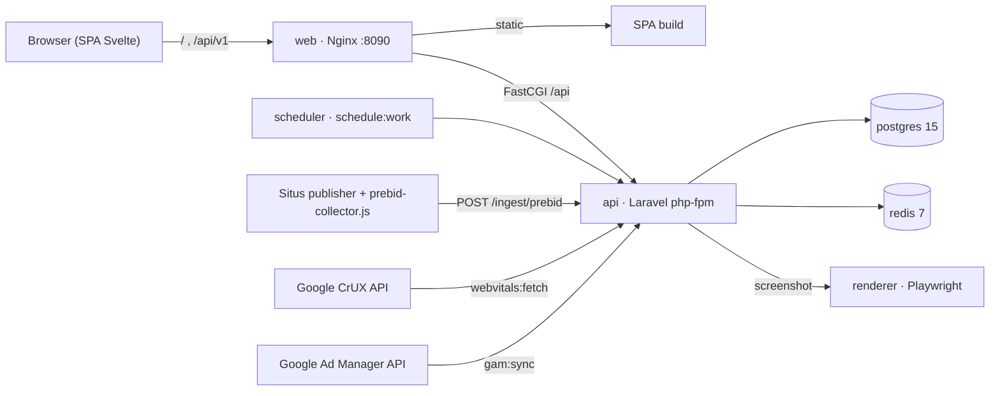

# Dashboard Monitoring Programmatic Ads & Website Performance

Dashboard internal untuk tim **Programmatic Revenue** memonitor kesehatan monetisasi
iklan **dan** performa website dalam satu tempat — dari slot iklan, bidding & Prebid.js,
koneksi Google Ad Manager (GAM), network request script ads, sampai **Web Core Vitals**
(LCP, INP, CLS, FCP, TTFB, TBT) — lengkap dengan alert berbasis threshold dan insight.

Tujuannya: **mendeteksi masalah lebih cepat, mengoptimalkan revenue programmatic, dan
menjaga user experience website tetap baik.**


---

## Daftar Isi

- [Fitur Utama](#fitur-utama)
- [Tech Stack](#tech-stack)
- [Arsitektur](#arsitektur)
- [Quick Start](#quick-start)
- [Kredensial Demo](#kredensial-demo)
- [Struktur Project](#struktur-project)
- [API](#api)
- [Integrasi Data Live](#integrasi-data-live)
- [Roles & RBAC](#roles--rbac)
- [Environment Variables](#environment-variables)
- [Testing](#testing)
- [Keamanan](#keamanan)
- [Dokumentasi](#dokumentasi)
- [Status & Disclaimer](#status--disclaimer)
- [Lisensi](#lisensi)

---

## Fitur Utama

| Modul | Deskripsi |
|---|---|
| **Dashboard Overview** | Ringkasan revenue, impression, ad request, fill rate, eCPM, bid request/response, timeout rate, GAM/Prebid health, Web Vitals, dan active alerts. |
| **Slot Performance** | Performa per ad slot: ad request, impression, revenue, eCPM, fill rate, viewability (per device). |
| **Bidding Monitoring** | Kesehatan bidder: bid request/response, win, timeout, error, latency, CPM. |
| **Prebid Health** | Auction Prebid.js: durasi, timeout, error, pemenang — via ingestion dari browser. |
| **GAM Monitoring** | Request ke Google Ad Manager: success/empty/failed, latency, HTTP status. |
| **Server Health** | Uptime & response time nyata per domain (synthetic monitoring tiap 5 menit). |
| **Network Ads** | Network request script ads & third-party JS: ukuran, durasi, blocking, heavy requests. |
| **Web Core Vitals** | LCP, INP, CLS, FCP, TTFB, TBT per domain/page/device (field data Google CrUX). |
| **Alerts & Insights** | Alert berbasis threshold (severity low→critical) + rekomendasi optimasi. |
| **Ad Layout Preview** 📱 | Snapshot mobile situs + peta posisi slot iklan (header-bidding vs direct), rendered Playwright. |
| **Security Site Inspector** 🛡️ | OSINT & security scan domain (DNS, SSL, headers, WHOIS, ports, DNSSEC, HTTP/2-3, tech) + grade A–F. |

Setiap halaman punya global filter (domain, date range, device), loading/empty/error state,
refresh, dan last-updated timestamp.

---

## Tech Stack

**Backend**
- Laravel `^13.8` (PHP `^8.3`) — REST API only, prefix `/api/v1`
- Autentikasi **JWT** (`php-open-source-saver/jwt-auth`)
- PostgreSQL 15 · Redis 7 (cache + queue) · Laravel Scheduler
- GAM connector (`googleads/googleads-php-lib`) · Testing PHPUnit

**Frontend**
- Svelte `^5.56` (SPA) + `svelte-spa-router`
- Vite `^8` · TypeScript `^5.9`
- Tailwind CSS `^3.4` + DaisyUI `^4.12` — tema **`samurai-blue`** (clean white + samurai blue)

**Renderer**
- Node + **Playwright** (di-pin `1.49.1`) — headless screenshot untuk Ad Layout Preview

**Infra**
- Docker Compose · Nginx (satu entrypoint: SPA + reverse-proxy API same-origin)

---

## Arsitektur

Laravel murni sebagai **API backend**, Svelte sebagai **SPA dashboard**. Semua komunikasi
lewat REST `/api/v1`; endpoint privat wajib JWT, endpoint role-specific wajib authorization.
Data volume besar dipaginasi/difilter/diagregasi di backend (dashboard membaca tabel
agregat harian, bukan raw event).



Detail service Docker & port ada di [Quick Start](#quick-start) dan [RUNNING.md](RUNNING.md).

---

## Quick Start

### Cara A — Docker Compose (rekomendasi)

Seluruh stack (PostgreSQL + Redis + Laravel php-fpm + Nginx + scheduler + renderer)
dengan satu perintah. Nginx jadi entrypoint tunggal di **http://localhost:8090**; frontend
memanggil API same-origin di `/api/v1` (tanpa CORS).

> Prasyarat: `backend/.env` ada dan berisi `APP_KEY` + `JWT_SECRET`
> (salin dari `backend/.env.example`, lalu `php artisan key:generate` & `php artisan jwt:secret`).
> Nilai DB/Redis/cache di-override oleh `docker-compose.yml`.

```bash
docker compose up -d --build                         # build + start semua service
docker compose exec api php artisan db:seed --force  # isi data demo (sekali)
# buka http://localhost:8090
```

| Service | Peran | Port host |
|---|---|---|
| `web` (nginx) | SPA + proxy `/api` | `8090` → 80 |
| `api` (php-fpm 8.3) | Laravel API (production) | internal `9000` |
| `postgres` | database | `5434` → 5432 |
| `redis` | cache + queue | internal `6379` |
| `renderer` | Playwright screenshot | internal `3000` |
| `scheduler` | `monitor:uptime` (5 mnt) + `webvitals:fetch` (harian) | — |

### Cara B — Manual (development)

```bash
# 1) PostgreSQL (host port 5433 agar tidak bentrok)
docker run -d --name ads-postgres -e POSTGRES_DB=ads_dashboard -e POSTGRES_USER=ads \
  -e POSTGRES_PASSWORD=ads_secret_2026 -p 5433:5432 postgres:15-alpine

# 2) Backend (API di http://localhost:8000/api/v1)
cd backend
cp .env.example .env && php artisan key:generate && php artisan jwt:secret
php artisan migrate:fresh --seed --force
php artisan serve --host=127.0.0.1 --port=8000

# 3) Frontend (SPA di http://localhost:5173)
cd frontend
npm install
npm run dev
```

Panduan lengkap (termasuk data live, rebuild volume, dsb.) → **[RUNNING.md](RUNNING.md)**.

---

## Kredensial Demo

Password semua user: **`password`**

| Email | Role | Akses |
|---|---|---|
| `admin@kgmedia.io` | admin | penuh |
| `rev@kgmedia.io` | programmatic_revenue | penuh + acknowledge alert |
| `adops@kgmedia.io` | adops | penuh + acknowledge alert |
| `tech.collab@kgmedia.io` | tech | penuh + acknowledge alert |
| `viewer@kgmedia.io` | viewer | read-only (tidak bisa acknowledge/scan/capture) |

`DemoSeeder` mengisi ~9.600 baris untuk 3 properti KG Media (**kompas.tv**, **parapuan.co**,
**sonora.id**) dalam rentang 30 hari: metrik harian, event auction/GAM/network, server health,
12 alert + 6 insight.

---

## Struktur Project

```text
.
├── backend/            # Laravel API (app/, routes/, database/migrations, tests/)
│   ├── app/
│   │   ├── Http/Controllers/Api/V1/   # controller tipis (validate → service → resource)
│   │   ├── Services/                   # business logic (metric, aggregation, alert)
│   │   ├── Models/  Enums/  DTOs/
│   ├── database/migrations/           # sumber schema (lihat Database.sql / DATABASE.md)
│   └── .env.example
├── frontend/           # Svelte 5 SPA (Vite + Tailwind + DaisyUI samurai-blue)
│   └── src/{lib/{api,components,stores,types,utils},routes}/
├── renderer/           # Node + Playwright (screenshot Ad Layout)
├── prebid-collector.js # snippet browser → POST /ingest/prebid
├── docker-compose.yml  # web · api · postgres · redis · scheduler · renderer
├── Database.sql        # DDL PostgreSQL kanonik
├── DATABASE.md         # ERD (Mermaid) + kamus data
├── CLAUDE.md · README.md · RUNNING.md · SECURITY.md · TESTING.md
```

---

## API

- **Base URL:** `/api/v1`
- **Auth:** `Authorization: Bearer <access_token>` (JWT) untuk semua endpoint privat.

| Grup | Endpoint |
|---|---|
| Auth | `POST auth/login` · `POST auth/logout` · `POST auth/refresh` · `GET auth/me` |
| Dashboard | `GET dashboard/overview` |
| Domains | `GET domains` |
| Slots | `GET slots` · `GET slots/{id}` |
| Bidders | `GET bidders` · `GET bidders/{id}` |
| Prebid | `GET prebid/health` · `GET prebid/auctions` |
| GAM | `GET gam/health` · `GET gam/requests` |
| Server | `GET server/health` · `GET server/checks` |
| Network Ads | `GET network-ads` · `GET network-ads/heavy-requests` |
| Web Vitals | `GET web-vitals` · `GET web-vitals/pages` |
| Alerts | `GET alerts` · `GET alerts/{id}` · `GET insights` · `PATCH alerts/{id}/acknowledge` 🔒 |
| Ad Layout | `GET previews` · `GET previews/{id}` · `POST previews/capture` 🔒 |
| Security | `GET security/scans` · `GET security/scans/{id}` · `GET security/scans/{id}/export` · `POST security/scan` 🔒 |
| Ingestion | `POST ingest/prebid` (ingest key + rate limit, **bukan** JWT) |

🔒 = write/expensive, dibatasi role (viewer read-only) + rate limit.

**Format response konsisten:**

```json
{
  "success": true,
  "data": {},
  "meta": { "request_id": "uuid", "timestamp": "2026-06-14T10:00:00Z" },
  "errors": []
}
```

---

## Integrasi Data Live

Selain data demo, ada sumber **nyata** (lihat [RUNNING.md](RUNNING.md) untuk setup detail):

| Sumber | Command / Endpoint | Kredensial |
|---|---|---|
| **Uptime & response time** | `monitor:uptime` (auto tiap 5 mnt) | — (aktif langsung) |
| **Web Vitals (Google CrUX)** | `webvitals:fetch` (auto harian) | `CRUX_API_KEY` (gratis) |
| **GAM revenue/impression** | `gam:sync --from --to` (auto 04:00) | Service account GAM |
| **Prebid auctions** | `POST /api/v1/ingest/prebid` | `PREBID_INGEST_KEY` + [`prebid-collector.js`](prebid-collector.js) |

Tanpa kredensial, command yang butuh key **skip dengan aman** (data demo tetap tampil).

---

## Roles & RBAC

`admin` · `programmatic_revenue` · `adops` · `tech` · `viewer`

Authorization ditegakkan di **backend** (middleware/policy), bukan sekadar menyembunyikan
menu di frontend. `viewer` bersifat read-only: tidak bisa acknowledge alert, menjalankan
security scan, atau capture ad-layout preview.

---

## Environment Variables

Kunci utama (`backend/.env` — lihat `backend/.env.example` untuk daftar lengkap):

```env
APP_KEY=            # php artisan key:generate
JWT_SECRET=         # php artisan jwt:secret
DB_CONNECTION=pgsql
DB_HOST=127.0.0.1   # "postgres" di Docker Compose
DB_PORT=5433        # 5432 di dalam Compose
FRONTEND_URL=http://localhost:5173

# Opsional (integrasi live)
CRUX_API_KEY=
GAM_NETWORK_CODE=
GAM_SERVICE_ACCOUNT_JSON=
PREBID_INGEST_KEY=
PREBID_INGEST_ORIGINS=
RENDERER_URL=http://renderer:3000
```

Frontend (`frontend/.env`): `VITE_API_BASE_URL=http://localhost:8000/api/v1`.

> ⚠️ **Jangan** commit `.env` asli atau kredensial GAM/GA4. `.gitignore` sudah menutup
> `.env`, `vendor/`, `node_modules/`. Hanya `.env.example` (placeholder) yang di-track.

---

## Testing

```bash
cd backend && php artisan test        # backend (PHPUnit)
cd frontend && npm run check          # type-check Svelte/TS
```

Strategi & konvensi test (unit, feature/API, auth, permission, validation, E2E) →
**[TESTING.md](TESTING.md)**.

> Catatan lokal: bila PHP host tak punya `pdo_sqlite`, jalankan phpunit dengan
> `-d extension=pdo_sqlite` (lihat RUNNING.md).

---

## Keamanan

Standar keamanan (JWT, RBAC, validasi input, CORS, deployment) →
**[SECURITY.md](SECURITY.md)**. Prinsip inti: semua endpoint privat JWT; semua endpoint
role-specific authorization; input divalidasi; tidak ada secret di kode; token/password
tidak di-log; tanpa raw SQL tanpa binding; `APP_DEBUG=false` di production.

---

## Dokumentasi

| Dokumen | Isi |
|---|---|
| [CLAUDE.md](CLAUDE.md) | Panduan arsitektur, konvensi backend/frontend, design system, metric & alert rules |
| [DATABASE.md](DATABASE.md) | ERD (Mermaid) + kamus data lengkap |
| [Database.sql](Database.sql) | DDL PostgreSQL kanonik |
| [RUNNING.md](RUNNING.md) | Menjalankan stack end-to-end (Docker & manual) + data live |
| [SECURITY.md](SECURITY.md) | Standar keamanan |
| [TESTING.md](TESTING.md) | Strategi testing |

---

## Status & Disclaimer

Aplikasi monitoring internal. Repository ini menyertakan **data demo** (dummy) dan
**tidak memuat kredensial/secret nyata** — integrasi GAM/CrUX/Prebid butuh kunci milik Anda
sendiri via environment variable. Nama domain (kompas.tv, parapuan.co, sonora.id) dipakai
sebagai contoh properti pada seeder.

---

## Lisensi

Dirilis di bawah [MIT License](LICENSE) — © 2026 Asri Zulfikar F.
Bebas dipakai, dimodifikasi, dan didistribusikan; disertakan tanpa jaminan (_as is_).
